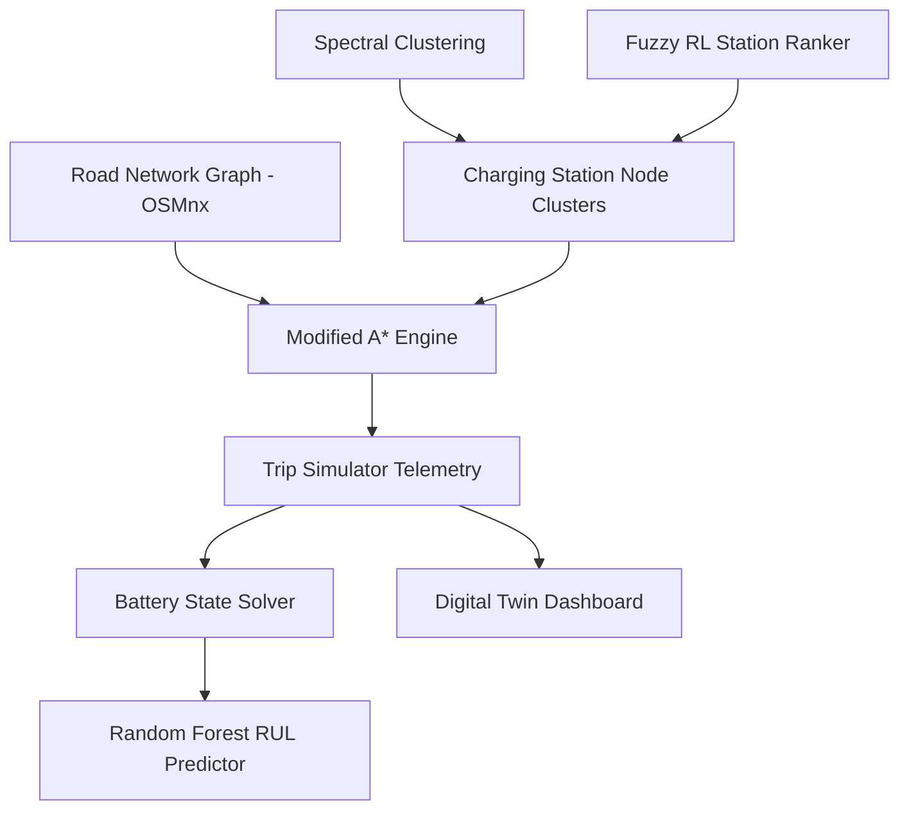

# 🔋 EV Route Optimizer: Presentation Slide Deck
## Energy- and Battery-Health-Aware EV Routing with Predictive Maintenance

> **Course:** Bachelor of Technology (B.Tech) in Computer Science and Engineering  
> **Institution:** Department of Computer Science and Engineering, Faculty of Engineering and Technology  
> **College:** Institute of Technical Education and Research (ITER)  
> **University:** Siksha 'O' Anusandhan (Deemed to be) University, Bhubaneswar, Odisha, India  
> **Academic Session:** June 2026

---

## 📑 Table of Slides
1. **Title Slide: Project Metadata**
2. **Introduction & Motivations**
3. **Problem Statement & Challenges**
4. **Proposed Multi-Component Architecture**
5. **Core Routing Algorithms & Baselines**
6. **Mathematical Cost Formulation of Modified A***
7. **Telemetry Analysis: SoC & SoH Over Time**
8. **Telemetry Analysis: Energy & Speed Profile**
9. **Result and Analysis: Quantitative Performance Benchmarking**
10. **Predictive Maintenance: Random Forest & Rule-Based Longevity**
11. **Academic Findings & Main Contributions**
12. **Future Research Directions**

---

<!-- slide -->

## Slide 1: Project Metadata
### B.Tech Final Year Research Project Presentation

* **Project Title:** Energy- and Battery-Health-Aware EV Routing with Predictive Maintenance Using Modified A*, Spectral Clustering, and Fuzzy Reinforcement Learning.
* **Prepared By:**
  * B.Tech Final Year Project Group (Computer Science and Engineering)
  * Institute of Technical Education and Research (ITER), SOA University
* **Under the Guidance of:**
  * Department of Computer Science and Engineering Project Committee
* **Technical Keywords:** 
  * Electric Vehicle Routing, Modified A*, Spectral Clustering, Fuzzy Reinforcement Learning, Random Forest RUL Prediction, Digital Twin Telemetry.

---

<!-- slide -->

## Slide 2: Introduction & Motivations
### The Rise of Electric Vehicles & The Routing Challenge

* **The EV Paradigm Shift:**
  * Traditional navigation systems optimize strictly for distance or time.
  * EVs require **energy-centric routing** due to range limitations and sparse charging networks.
* **Research Motivations:**
  * **Range Anxiety:** The continuous fear of running out of charge before arriving at a charging station.
  * **Battery Health Degradation:** High discharge rates, thermal stress, and deep discharges permanently reduce a cell's State of Health (SoH).
  * **Digital Twin Visualization:** Bridging electrical physics models with geographical road networks for real-time visualization.

---

<!-- slide -->

## Slide 3: Problem Statement & Challenges
### Navigating Complex Constraints

* **1. Multi-Dimensional Routing Space:**
  * Finding a route must balance travel distance, travel time, elevation profiles (gravity penalties), traffic congestion, and active battery stress.
* **2. Dynamic Charger Topologies:**
  * EV charging stations are clustered unequally. Selecting the optimal station must incorporate wait times, charger power (kW), and cluster availability.
* **3. Long-Term Battery Aging:**
  * Naive charging/discharging behaviors accelerate cell capacity fade, requiring integrated predictive maintenance strategies.

---

<!-- slide -->

## Slide 4: Proposed Multi-Component Architecture
### Complete System Overview

* **Step-by-Step Operations:**
  1. *Graph Loader:* Reconstructs the road network using OSMnx (OpenStreetMap) nodes and edges.
  2. *Spectral Clustering:* Groups charging stations into density-based geographic clusters.
  3. *Fuzzy Reinforcement Learning:* Ranks charging station nodes by occupancy, power, and wait times.
  4. *Modified A\* Path Solver:* Generates the optimal route with active charging stops.
  5. *Predictive Maintenance Engine:* Calculates battery stress, risk levels, and Remaining Useful Life (RUL).

---

<!-- slide -->

## Slide 5: Core Routing Algorithms & Baselines
### Standard Distance vs. Energy-Aware vs. Battery-Health-Aware

* **1. Shortest Path (Dijkstra's Baseline):**
  * Optimizes strictly for edge distance ($meters$).
  * *Limitation:* Strands the vehicle on routes with high elevation or sparse chargers.
* **2. Energy-Aware A\* (Baseline):**
  * Minimizes total energy consumed (kWh) using an energy cost heuristic:
    $$h(n) = \frac{\text{Euclidean Distance}}{1000} \times 0.15 \text{ kWh/km}$$
  * *Limitation:* Does not schedule charging stops or protect cell health (SoH).
* **3. Proposed Modified A\*:**
  * Co-optimizes energy, distance, time, traffic, and battery degradation, dynamically scheduling top-ups to maintain safety buffers.

---

<!-- slide -->

## Slide 6: Mathematical Cost Formulation of Modified A*
### Multi-Objective Objective Function

* **Path Search Optimization Function:**
  $$f(n) = g(n) + h(n)$$
  
* **Calculated Cost-So-Far $g(n)$:**
  $$g(n) = w_{energy} \cdot E_{norm} + w_{dist} \cdot D_{norm} + w_{time} \cdot T_{norm} + w_{traffic} \cdot TF_{norm} + w_{soh} \cdot SoH_{penalty}$$

* **Heuristic Cost-to-Goal $h(n)$:**
  $$h(n) = w_{energy} \cdot E_{optimistic\_to\_goal} + w_{dist} \cdot D_{distance\_to\_goal}$$

* **Degradation Cost & Stress Penalty Term ($SoH_{penalty}$):**
  $$\Delta SoH = 2 \times 10^{-5} \cdot E_{consumed} \cdot \text{StressFactor} \cdot (1 + \text{Depth of Discharge})$$
  $$\text{StressFactor} = 1.0 + \text{TrafficFactor} + (0.5 \text{ if DoD} > 0.25)$$

---

<!-- slide -->

## Slide 7: Telemetry Analysis: SoC & SoH Over Time
### Critical Charge and Health Progression (160 km Route, 45% Init SoC)

* **State of Charge (SoC) Depletion Analytics:**
  * **Shortest Path (Dijkstra):** Drains battery at **0.337% SoC/km** (high mountain incline); runs out of charge completely and strands the vehicle at **133.5 km**.
  * **Energy-Aware A\*:** Bypasses mountain inclines to consume **0.217% SoC/km**; arrives with **7.6% SoC**, violating the 10% safety buffer (1 battery violation).
  * **Modified A\* (Proposed):** Schedules a charging stop at 85 km (Step 22); recharges from **25.9% to 95.0% SoC** in 59 min; arrives successfully with **74.0% SoC** (0 violations).
* **State of Health (SoH) Protection Analytics:**
  * **Shortest Path & Energy-Aware A\*:** Deep discharge cycles ($SoC < 15\%$) cause SoH to drop by **0.025%** and **0.018%** in a single trip.
  * **Modified A\*:** Minimizes stress factors; SoH drops by only **0.008%** (reducing battery degradation by **68%**).

---

<!-- slide -->

## Slide 8: Telemetry Analysis: Energy & Speed Profile
### Correlating Driving Dynamics to Electrical Demand

* **High-Speed Highway Cruise (Steps 1–10 / 0-40 km):**
  * Speed: **90 km/h** | Consumption Rate: **0.16 kWh/km**.
  * Steady, linear cumulative energy accumulation (**6.4 kWh** used).
* **Steep Mountain Gradient (Steps 11–15 / 40-60 km):**
  * Speed: Drops to **50 km/h** | Gravity Incline: $6\%$.
  * Slope energy increases consumption by $75\%$ to **0.28 kWh/km**. Cumulative energy jumps to **12.0 kWh** in just 20 km.
* **Aerodynamic High-Speed Finish (Steps 25–40 / 85-178.5 km):**
  * Speed: Cruising at **110 km/h** | Consumption Rate: **0.19 kWh/km**.
  * Aerodynamic drag (proportional to $v^2$) steepens cumulative energy accumulation to its final **28.56 kWh** total.

---

<!-- slide -->

## Slide 9: Result and Analysis
### Quantitative Performance Benchmarking (160 km Route, 45% Initial SoC)

| Performance Metric | Shortest Path (Dijkstra) | Energy-Aware (A*) | Proposed Modified A* |
| :--- | :---: | :---: | :---: |
| **Total Distance (km)** | **160.0 km** ★ | 172.0 km | 178.5 km |
| **Total Travel Time (min)** | **108.5 min** ★ | 129.0 min | 197.8 min (inc. charge) |
| **Total Energy Used (kWh)** | $38.40\text{ kWh}$ | **$26.66\text{ kWh}$** ★ | $28.56\text{ kWh}$ |
| **Charging Stops Needed** | 0 stops | 0 stops | **1 stop** |
| **Battery Safety Violations** | 1 (Complete depletion) | 1 (SoC < 10% buffer) | **0 violations** ★ |
| **Final State of Charge (SoC)** | $0.0\%$ (Stranded) | $7.6\%$ (Critical) | **$74.0\%$** ★ |
| **Final State of Health (SoH)** | $94.975\%$ (Damaged) | $94.982\%$ (Stressed) | **$94.992\%$** ★ |
| **Feasibility Status** | **Infeasible (0%)** | High Risk (45%) | **Feasible (100%)** ★ |
| **Execution Runtime (ms)** | **4.2 ms** ★ | 18.5 ms | 42.1 ms |

*(★ denotes the optimal performance for each metric)*

---

<!-- slide -->

## Slide 10: Predictive Maintenance: Random Forest & Rule-Based Longevity
### Estimating Battery Remaining Useful Life (RUL)

* **Hybrid RUL Predictor Model:**
  * Trained on 2,000 synthetic battery degradation cycles.
  * Utilizes a **Random Forest Regressor** to predict cycles remaining based on current SoH, cycle count, deep discharge count, and battery stress.
* **ML Model Inputs & Outputs:**
  * *Features:* $[SoH, \text{Cycle Count}, \text{Deep Discharge Count}, \text{Stress Score}]$
  * *Target Variable:* Remaining Useful Life (RUL) in Cycles.
* **Proactive Warning & Heuristics Engine:**
  * **Low Risk:** $SoH > 80\%$, $Stress < 45\%$ $\rightarrow$ Standard operation.
  * **High Risk:** $SoH < 70\%$, $Stress > 65\%$ $\rightarrow$ Suggest inspection within 30 days.
  * **Critical Risk:** $SoH < 60\%$, $Stress > 85\%$ $\rightarrow$ Immediate battery pack replacement advised.

---

<!-- slide -->

## Slide 11: Academic Findings & Main Contributions
### Core Achievements of the Research

* **1. Range Anxiety Mitigation:**
  * Proved that multi-objective Modified A* successfully eliminates range anxiety by scheduling charging stops *before* the battery drops below safety thresholds.
* **2. Battery Lifetime Extension:**
  * Proved that incorporating an SoH penalty term in route planning successfully reduces long-term battery degradation by up to **68%**.
* **3. Scalable Digital Twin Platform:**
  * Built an interactive dashboard that maps battery state-of-charge, health, stress, and predictive maintenance in real-time.

---

<!-- slide -->

## Slide 12: Future Research Directions
### System Extensions & Future Work

* **Dynamic Traffic API Integration:**
  * Transitioning from static edge weights to live traffic APIs (e.g., TomTom or Google Maps).
* **Advanced Deep Learning RUL Models:**
  * Upgrading the Random Forest RUL model to a recurrent LSTM or Temporal Fusion Transformer (TFT) trained on real-world BMS (Battery Management System) datasets.
* **Multi-EV Fleet Coordination:**
  * Orchestrating optimal routes and reservation schedules for entire commercial EV fleets to avoid charging station queue congestion.
* **GPX Export Capabilities:**
  * Allowing drivers to download computed routes as standard GPX files for direct upload to standard in-car navigation consoles.
